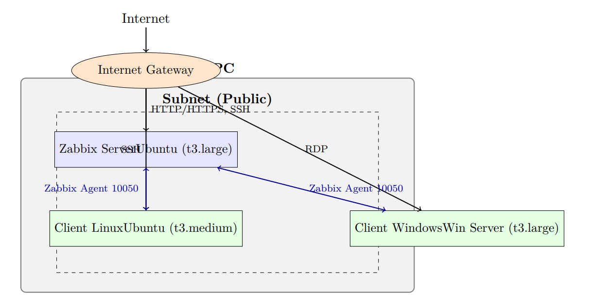
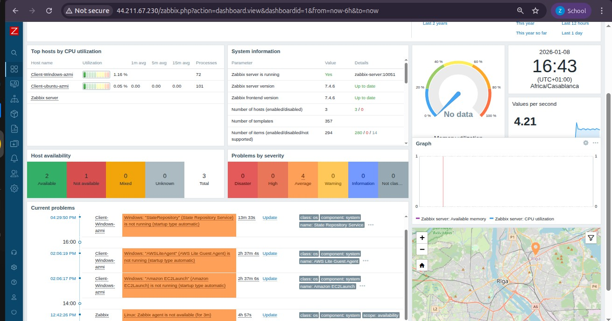
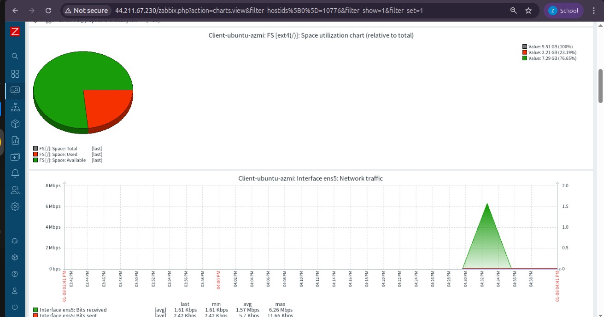
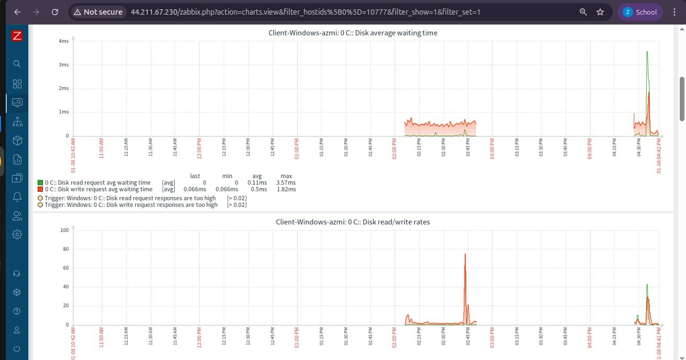

# AWS Zabbix Monitoring Project

## Présentation

Ce projet met en œuvre une infrastructure de supervision centralisée sur AWS, utilisant Zabbix (via Docker) pour monitorer un parc hybride Linux & Windows. Il inclut la configuration réseau, le déploiement des instances, l'installation de Zabbix et des agents, et la visualisation des métriques.

---

## Architecture

---

## Étapes principales

### 1. Accès AWS & Création du VPC

Création d'un VPC dédié pour isoler l'environnement de supervision.

### 2. Sous-réseau, Passerelle Internet & Routage

### 3. Groupes de sécurité

### 4. Déploiement des instances EC2

### 5. Installation & Configuration du serveur Zabbix

Connexion SSH :

Installation Docker & Compose :

Déploiement Zabbix via Docker Compose :

### 6. Accès à l'interface Zabbix

### 7. Configuration des clients

#### Linux

#### Windows

### 8. Ajout des hôtes dans Zabbix

### 9. Supervision & Tableaux de bord

---

## Conclusion

Ce projet démontre la mise en place d'une supervision efficace sur AWS avec Zabbix, couvrant la configuration réseau, le déploiement automatisé, l'intégration d'agents et la visualisation graphique des métriques. Toutes les étapes sont illustrées par des captures d'écran pour faciliter la reproduction.

---

## Auteur & Remerciements

Encadrant : Prof. Azeddine KHIAT  
Année universitaire : 2025/2026

---

## Liens utiles

- [Documentation Zabbix](https://www.zabbix.com/documentation/current/manual/)
- [AWS Academy](https://aws.amazon.com/training/awsacademy/)
- [Dépôt GitHub du projet](https://github.com/yourusername/aws-zabbix-monitoring-project)
